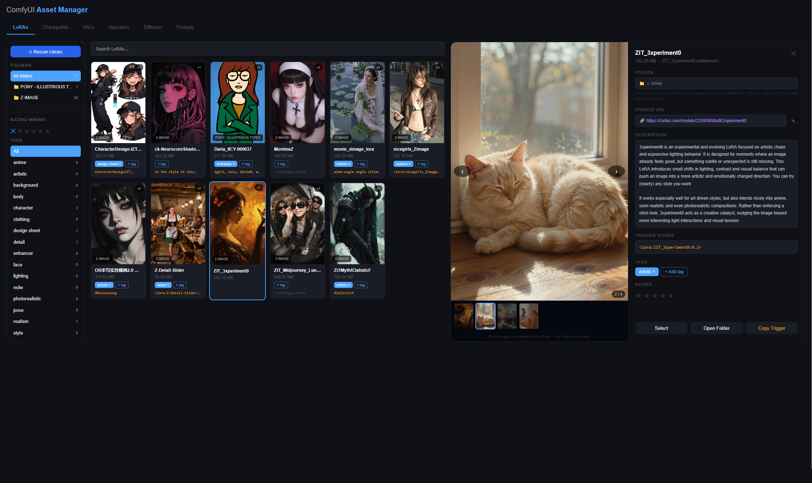

# ComfyUI Model Librarian

A standalone local web app to browse, organize, and annotate your entire ComfyUI model library.



> **Note:** The app runs fully locally — no accounts, no background calls, nothing phoning home. Preview images and metadata shown in screenshots were added manually (see [Preview image convention](#preview-image-convention) below). There is no automatic Civitai import yet — that's a planned feature.

---

## Looking for a ComfyUI-integrated solution?

If you want something that lives inside ComfyUI itself with Civitai auto-import, custom nodes, and workflow integration, check out [ComfyUI-Lora-Manager](https://github.com/willmiao/ComfyUI-Lora-Manager) by willmiao — it's the go-to plugin for that use case.

**This project is different:** it runs as a separate standalone app, independently of ComfyUI. No plugin installation needed, and it works even when ComfyUI isn't running.

---

## What it does

- Browse **LoRAs, Checkpoints, VAEs, Upscalers, and Diffusion models** in a visual grid
- **Tag, rate, and annotate** models with trigger words, descriptions, and source URLs
- **Image carousel** per model — multiple previews, GIFs supported
- **Prompt Gallery** — drop ComfyUI output images to extract and save generation metadata
- **Rescan** to sync with disk automatically on launch or on demand

---

## Requirements

- Python 3.10+
- Node.js 18+
- MySQL (local install — e.g. via XAMPP, MySQL Workbench, or standalone)
- Windows (the folder launcher and Explorer integration use `.bat` and `subprocess` — untested on Mac/Linux)

---

## Project Structure

```
comfyui-model-librarian/
├── backend/
│   ├── api.py
│   ├── lora_manager.py
│   ├── model_manager.py
│   ├── comfy_metadata.py
│   ├── .env                 ← you create this (never committed)
│   └── .env.example         ← template
├── frontend/
│   └── src/
│       ├── App.jsx
│       └── components/
│           ├── LoraBrowser.jsx
│           ├── ModelBrowser.jsx
│           └── PromptGallery.jsx
├── migrate.sql
├── migrate_models.sql
├── migrate_prompts.sql
├── start.bat
└── README.md
```

---

## Setup

### 1. Database

Run the three SQL files in DBeaver (or any MySQL client) in order:
`migrate.sql` → `migrate_models.sql` → `migrate_prompts.sql`

Then run these two lines to add rating support:
```sql
ALTER TABLE loras  ADD COLUMN rating TINYINT DEFAULT 0;
ALTER TABLE models ADD COLUMN rating TINYINT DEFAULT 0;
```

### 2. Environment

Copy `backend/.env.example` → `backend/.env` and fill in your paths:

```env
DB_HOST=localhost
DB_USER=root
DB_PASSWORD=your_password
DB_NAME=comfyui_assets

LORA_FOLDER=C:\path\to\ComfyUI\models\loras
CHECKPOINT_FOLDER=C:\path\to\ComfyUI\models\checkpoints
VAE_FOLDER=C:\path\to\ComfyUI\models\vae
UPSCALER_FOLDER=C:\path\to\ComfyUI\models\upscale_models
DIFFUSION_FOLDER=C:\path\to\ComfyUI\models\diffusion_models
```

### 3. Install & run

```bash
pip install flask flask-cors mysql-connector-python python-dotenv pillow
cd frontend && npm install
```

Then double-click `start.bat`.

---

## Preview image convention

Preview images are **not fetched automatically** — you need to place them next to your model files manually, or they won't appear in the UI.

```
MyModel.safetensors     ← model
MyModel.preview.png     ← main preview
MyModel_01.png          ← extra images
MyModel_02.gif          ← GIFs supported
images/MyModel_03.png   ← or inside an images/ subfolder
```

---

## Planned

- [ ] Auto-import preview images and metadata from Civitai by model hash
- [ ] A1111 support for Prompt Gallery metadata extraction